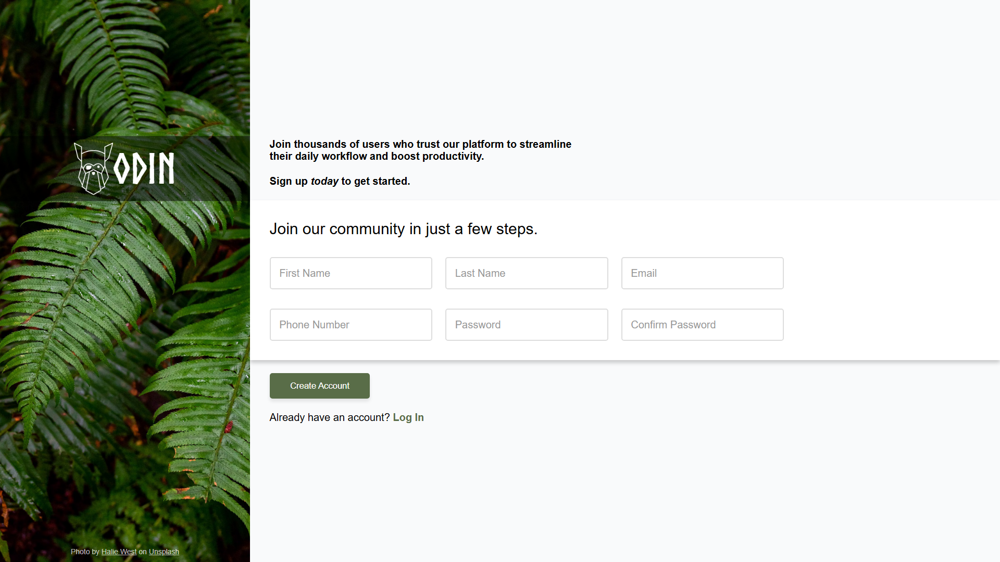

# Sign-Up Form

A modern, simple sign-up form built with HTML and CSS.

**[Live Preview](https://4hmedsalah.github.io/sign-up-form/)**

  
  

## Features

- **Modern Design**: Clean, minimalist interface with professional styling
- **Floating Labels**: Smooth animated labels that float above inputs when focused
- **Form Validation**: HTML pattern validation for secure password requirements
- **Accessibility**: Semantic HTML structure with proper form labels and attributes
- **Visual Feedback**: Color-coded validation states for better user experience

## Technologies Used

- **HTML5**: Semantic markup and form validation
- **CSS3**: Modern styling with flexbox layout and smooth transitions

## Getting Started

1. Clone or download the repository
2. Open `index.html` in your web browser
3. Fill out the form to test validation features

## Contributing

This is a practice project for learning web development. Feel free to fork and experiment with additional features.

## License

This project is open source and available under the [MIT License](LICENSE).
